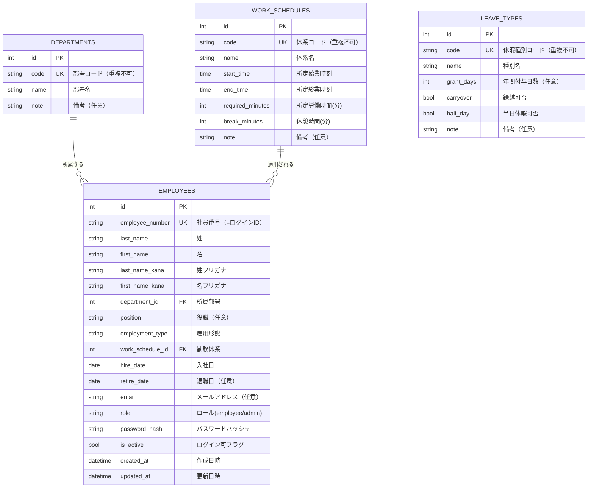
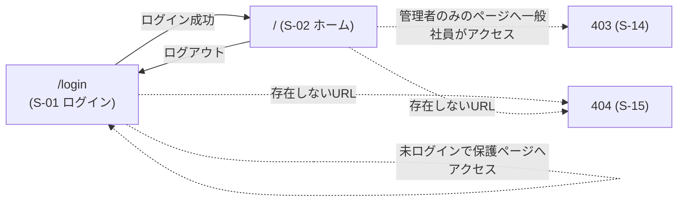

# 勤怠管理システム 基本設計書（Phase 0：基盤構築・認証）

| 項目 | 内容 |
|------|------|
| 文書番号 | BD-001 |
| バージョン | 0.1 |
| 作成日 | 2026-09-01 |
| ステータス | レビュー中（未承認） |
| 適用範囲 | Phase 0（基盤構築・認証） |
| 作成者 | Claude Code（開発メンバー） |

---

## 変更履歴

| 版 | 日付 | 変更内容 | 承認 |
|----|------|----------|------|
| 0.1 | 2026-09-01 | 初版作成（Phase 0：基盤構築・認証） | - |

---

## 目次

1. [はじめに](#1-はじめに)
2. [全体アーキテクチャ](#2-全体アーキテクチャ)
3. [設定設計](#3-設定設計)
4. [データベース設計](#4-データベース設計)
5. [画面設計](#5-画面設計)
6. [処理設計](#6-処理設計)
7. [認証・セキュリティ設計](#7-認証セキュリティ設計)
8. [エラーハンドリング設計](#8-エラーハンドリング設計)
9. [非機能要件との対応](#9-非機能要件との対応)
10. [Phase 0 完了条件（受入条件）](#10-phase-0-完了条件受入条件)
11. [次のフェーズへの引継ぎ事項](#11-次のフェーズへの引継ぎ事項)

---

## 1. はじめに

### 1.1 この文書の目的

本基本設計書は、要件定義書（`docs/01_要件定義.md`）で定義された機能のうち、**Phase 0（基盤構築・認証）** の「どう作るか」を具体的に定義する。

Phase 0 の完了条件は要件定義書の通り、**「ログインができる」** である。そのために必要な土台（プロジェクト構成・設定・DBスキーマ・認証基盤）をここで確定する。

### 1.2 対象範囲

Phase 0 で設計・実装する範囲は以下の通り。

| 種別 | 内容 |
|------|------|
| プロジェクト基盤 | `app/` 配下のディレクトリ構成、アプリのエントリポイント |
| 設定管理 | `.env`・環境変数の読み込み（pydantic-settings） |
| DB基盤 | SQLAlchemy モデルの Base、エンジン・セッション、Alembic マイグレーション |
| DBスキーマ（モデル定義のみ） | `departments` / `work_schedules` / `leave_types` / `employees` |
| シードデータ | ダミー社員・マスタの投入（`app/seed.py`） |
| 認証 | ログイン（F-01）、ログアウト（F-02）、ロール制御（F-03） |
| 画面 | S-01 ログイン / S-02 ホーム（最小構成）/ S-14 403 / S-15 404 |

### 1.3 対象外（後のフェーズで設計・実装）

| 機能 | フェーズ |
|------|---------|
| マスタ管理画面（部署・社員・勤務体系・休暇種別の CRUD） | Phase 1 |
| 打刻機能（F-09〜F-14）・`time_records` テーブル | Phase 2 |
| 勤怠照会（カレンダー・日次）・デイリー修正 | Phase 3 |
| 集計・CSV 出力 | Phase 4 |

> マスタの **テーブル定義** は Phase 0 で行う（`employees` の外部キー先であるため）。ただし **管理画面（CRUD）は Phase 1** で実装する。

---

## 2. 全体アーキテクチャ

### 2.1 レイヤ構成

要件定義書 8.2 の方針に従い、以下のレイヤに分割する。

```
ブラウザ（画面）
   │  HTTPリクエスト / レスポンス
   ▼
┌────────────────────────────────────────────────┐
│ ルーター（app/api/routes/）   … 画面遷移・入出力の受け口 │
│   URL と処理の対応付け、リクエスト検証           │
├────────────────────────────────────────────────┤
│ サービス（app/services/）    … ビジネスロジック   │
│   ログイン判定・パスワード照合などの業務ルール    │
├────────────────────────────────────────────────┤
│ リポジトリ（app/repositories/）… DBアクセスのみ  │
│   SQLAlchemy セッションを渡してモデルを検索・保存 │
├────────────────────────────────────────────────┤
│ モデル（app/models/）       … テーブル定義       │
│   SQLAlchemy の ORM モデル（1テーブル=1クラス）   │
└────────────────────────────────────────────────┘
   │  SQLAlchemy ORM
   ▼
SQLite データベース（data/attendance.db）
```

**レイヤ間のルール（重要）**

| ルール | 内容 |
|--------|------|
| ルール1 | ルーターは**リクエストの受け付けとレスポンスの返却のみ**を行う。ビジネスルールを直接書かない |
| ルール2 | サービスは**ビジネスルール**を書く。DB アクセスはリポジトリに依頼する |
| ルール3 | リポジトリは**DB の読み書きのみ**を行う。ビジネスルールを書かない |
| ルール4 | モデルは**テーブル定義**のみ。ビジネスロジックを持たせない（学習のため現段階ではシンプルに保つ） |

> 学習初期段階では、機能が小さいうちにレイヤを分けすぎないことも大切。ただし本プロジェクトは「実務的な構成を学ぶ」ことが目的のため、**Phase 0 からこの 4 層を貫く**。機能が増えるほどこの分離が効いてくる。

### 2.2 ディレクトリ構成

```
TimPoPro-USMR/
├── app/                          # アプリケーション本体
│   ├── __init__.py
│   ├── main.py                   # アプリのエントリポイント（FastAPI インスタンス生成）
│   ├── core/                     # 共通基盤
│   │   ├── __init__.py
│   │   ├── config.py             # 設定クラス（pydantic-settings）
│   │   ├── security.py           # パスワードハッシュ・セッションのユーティリティ
│   │   └── templates.py          # Jinja2 テンプレートの設定・読み込み
│   ├── db/                       # DB 基盤
│   │   ├── __init__.py
│   │   ├── base.py               # SQLAlchemy の Base（モデルの親クラス）
│   │   └── session.py            # エンジン・セッションファクトリの定義
│   ├── seed.py                   # ダミーデータ投入スクリプト（python -m app.seed で実行）
│   ├── models/                   # ORM モデル（1テーブル=1ファイル）
│   │   ├── __init__.py
│   │   ├── department.py         # departments テーブル
│   │   ├── work_schedule.py      # work_schedules テーブル
│   │   ├── leave_type.py         # leave_types テーブル
│   │   └── employee.py           # employees テーブル
│   ├── schemas/                  # Pydantic スキーマ（フォーム入力の検証用）
│   │   ├── __init__.py
│   │   └── auth.py               # ログインフォームのスキーマ
│   ├── repositories/             # DB アクセス層
│   │   ├── __init__.py
│   │   └── employee_repository.py# 社員の検索・保存
│   ├── services/                 # ビジネスロジック層
│   │   ├── __init__.py
│   │   └── auth_service.py       # ログイン・ログアウトの業務処理
│   ├── api/                      # ルーター層
│   │   ├── __init__.py
│   │   └── routes/
│   │       ├── __init__.py
│   │       ├── auth.py           # ログイン画面・ログイン処理・ログアウト
│   │       ├── home.py           # ホーム画面
│   │       └── deps.py           # 依存性注入（現在のユーザー取得・ロール制御）
│   └── templates/                # Jinja2 テンプレート
│       ├── base.html             # 全画面共通のレイアウト
│       ├── login.html            # S-01 ログイン画面
│       ├── home.html             # S-02 ホーム画面
│       └── errors/
│           ├── 403.html          # S-14 権限エラー画面
│           └── 404.html          # S-15 ページ不存在画面
├── alembic/                      # Alembic マイグレーション（自動生成）
├── data/                         # SQLite DB ファイル（git 管理外）
├── docs/                         # ドキュメント
├── .env.example
├── .gitignore
├── README.md
└── requirements.txt
```

### 2.3 リクエスト処理の流れ（例：ログイン）

```
1. ブラウザが /login に GET リクエスト
   → ルーター（auth.py）が login_form 画面を返す
2. ユーザーが社員ID・パスワードを入力し POST
   → ルーターがフォームを受け取り、Pydantic スキーマで検証
   → サービス（auth_service）に認証を依頼
   → サービスはリポジトリで社員を検索し、パスワードを照合
   → 成功: セッションに社員IDを保存 → ホーム画面へリダイレクト
   → 失敗: エラーメッセージ付きでログイン画面を再表示
```

---

## 3. 設定設計

### 3.1 環境変数一覧（`.env`）

`.env.example` に定義済みの設定を、Python 側で読み込む。

| 環境変数 | 型 | デフォルト | 説明 |
|----------|----|-----------|------|
| `APP_ENV` | str | `dev` | 実行環境（dev / test / prod） |
| `DEBUG` | bool | `True` | True で詳細エラーログ表示（開発用） |
| `SECRET_KEY` | str | `change-me-please` | セッション署名用の秘密鍵。**必ず本番相当で変更** |
| `DATABASE_URL` | str | `sqlite:///./data/attendance.db` | DB 接続文字列 |

### 3.2 設定の読み込み方式

- `app/core/config.py` に `Settings` クラス（pydantic-settings の `BaseSettings`）を定義
- アプリ内では `get_settings()` で一度だけ読み込み、使い回す（キャッシュ）
- `.env` ファイルはプロジェクトルートから読み込む

### 3.3 設定利用の注意

- `SECRET_KEY` は開発中は `.env.example` の値で動くが、**実運用では必ずランダムな長い文字列に変更**する
  - 生成例: `python -c "import secrets; print(secrets.token_hex(32))"`
- `.env` は git 管理対象外（`.gitignore` で除外済み）。パブリックリポジトリなので秘密情報をコミットしないこと

---

## 4. データベース設計

### 4.1 接続設定

| 項目 | 内容 |
|------|------|
| DB 種別 | SQLite（ファイルベース） |
| 接続文字列 | `DATABASE_URL`（デフォルト: `sqlite:///./data/attendance.db`） |
| 保存場所 | `data/` ディレクトリ配下（git 管理外） |
| 外部キー制約 | SQLite はデフォルトで FK 制約が無効。接続時に `PRAGMA foreign_keys=ON` を有効にする |

### 4.2 Phase 0 で定義するテーブル

認証とその前提となる人事マスタのみ定義する。打刻・勤怠系テーブルは各フェーズで追加する。

| テーブル | 分類 | 用途 | 設計フェーズ |
|----------|------|------|:---:|
| `departments` | マスタ | 部署 | Phase 0 |
| `work_schedules` | マスタ | 勤務体系（所定労働時間の基準） | Phase 0 |
| `leave_types` | マスタ | 休暇種別 | Phase 0 |
| `employees` | マスタ | 社員（=ログインユーザー） | Phase 0 |
| `time_records` | トランザクション | 打刻記録 | Phase 2 |
| `daily_records` | トランザクション | 日別勤怠 | Phase 2 |
| `leave_records` | トランザクション | 休暇・欠勤記録 | Phase 3 |
| `corrections` | 履歴 | 修正履歴 | Phase 3 |
| `monthly_summaries` | 集計結果 | 月次集計 | Phase 4 |

### 4.3 ER 図（Phase 0 対象テーブル）



### 4.4 テーブル詳細定義

#### 4.4.1 `departments`（部署マスタ）

| カラム | 型 | NULL | デフォルト | 制約 | 説明 |
|--------|----|:---:|-----------|------|------|
| `id` | Integer | - | - | PK, autoincrement | 主キー |
| `code` | String(20) | - | - | UNIQUE, NOT NULL | 部署コード |
| `name` | String(100) | - | - | NOT NULL | 部署名 |
| `note` | String(255) | ○ | NULL | - | 備考 |

> **設計メモ**: 社員が所属している部署の削除は Phase 1 の整合性チェックで対応する（要件 F-04）。Phase 0 ではテーブル定義のみ。

#### 4.4.2 `work_schedules`（勤務体系マスタ）

| カラム | 型 | NULL | デフォルト | 制約 | 説明 |
|--------|----|:---:|-----------|------|------|
| `id` | Integer | - | - | PK, autoincrement | 主キー |
| `code` | String(20) | - | - | UNIQUE, NOT NULL | 体系コード |
| `name` | String(100) | - | - | NOT NULL | 体系名 |
| `start_time` | Time | - | - | NOT NULL | 所定始業時刻（例 09:00） |
| `end_time` | Time | - | - | NOT NULL | 所定終業時刻（例 18:00） |
| `required_minutes` | Integer | - | - | NOT NULL | 所定労働時間（分）。例: 480（=8時間） |
| `break_minutes` | Integer | - | 0 | NOT NULL | 休憩時間（分）。例: 60 |
| `note` | String(255) | ○ | NULL | - | 備考 |

> **設計メモ**: 時刻は `datetime.time` 型で保存する。所定労働時間・休憩時間は「分」の整数で持ち、表示時に `HH:MM` へ変換する。時間計算を float（2.5時間 等）で持つと丸め誤差が起きるため、**分単位の整数**を採用する。これは以降の勤怠計算（Phase 2〜4）でも共通の方針。

#### 4.4.3 `leave_types`（休暇種別マスタ）

| カラム | 型 | NULL | デフォルト | 制約 | 説明 |
|--------|----|:---:|-----------|------|------|
| `id` | Integer | - | - | PK, autoincrement | 主キー |
| `code` | String(20) | - | - | UNIQUE, NOT NULL | 種別コード（例: PAID / KEIGA / KESSKI） |
| `name` | String(100) | - | - | NOT NULL | 種別名（例: 年次有給休暇） |
| `grant_days` | Integer | ○ | NULL | - | 年間付与日数（任意） |
| `carryover` | Boolean | - | False | NOT NULL | 繰越可否 |
| `half_day` | Boolean | - | False | NOT NULL | 半日休暇可否 |
| `note` | String(255) | ○ | NULL | - | 備考 |

#### 4.4.4 `employees`（社員マスタ ＝ ログインユーザー）

| カラム | 型 | NULL | デフォルト | 制約 | 説明 |
|--------|----|:---:|-----------|------|------|
| `id` | Integer | - | - | PK, autoincrement | 主キー |
| `employee_number` | String(20) | - | - | UNIQUE, NOT NULL | 社員番号（ログインID としても使用） |
| `last_name` | String(50) | - | - | NOT NULL | 姓 |
| `first_name` | String(50) | - | - | NOT NULL | 名 |
| `last_name_kana` | String(100) | - | - | NOT NULL | 姓フリガナ（カナ） |
| `first_name_kana` | String(100) | - | - | NOT NULL | 名フリガナ（カナ） |
| `department_id` | Integer | - | - | FK → departments.id, NOT NULL | 所属部署 |
| `position` | String(100) | ○ | NULL | - | 役職（任意） |
| `employment_type` | String(20) | - | - | NOT NULL | 雇用形態（seishain / keiyaku / arbeit） |
| `work_schedule_id` | Integer | - | - | FK → work_schedules.id, NOT NULL | 適用される勤務体系 |
| `hire_date` | Date | - | - | NOT NULL | 入社日 |
| `retire_date` | Date | ○ | NULL | - | 退職日。入るとログイン不可 |
| `email` | String(255) | ○ | NULL | - | メールアドレス（任意） |
| `role` | String(20) | - | `employee` | NOT NULL | ロール（`employee` / `admin`） |
| `password_hash` | String(255) | - | - | NOT NULL | パスワードハッシュ（bcrypt） |
| `is_active` | Boolean | - | True | NOT NULL | ログイン可フラグ（退職で False 等） |
| `created_at` | DateTime | - | 現在時刻 | NOT NULL | 作成日時 |
| `updated_at` | DateTime | - | 現在時刻 | NOT NULL | 更新日時 |

**制約・業務ルールの補足**

| ルール | 内容 |
|--------|------|
| ログインID | `employee_number` を使用する |
| ロール | `employee`（一般社員） / `admin`（管理者） の2値。DB には文字列で保存 |
| ログイン可否 | `is_active=True` かつ `retire_date` が過去でない場合のみログイン可 |
| 雇用形態 | 定数で管理（`seishain`=正社員 / `keiyaku`=契約社員 / `arbeit`=アルバイト）。画面表示は日本語へ変換 |

> **設計メモ**: 退職（`retire_date` 設定）しても社員レコードは削除せず残す（要件 F-05）。勤怠データとの整合性を保つため。

### 4.5 シードデータ設計（`app/seed.py`）

パブリックリポジトリのため、**ダミーデータのみ**を投入する（test-data スキルの方針）。

**投入するデータ**

| データ | 内容 |
|--------|------|
| 部署 | 総務部 / 営業部 / 開発部（3件） |
| 勤務体系 | 標準8時間勤務（09:00〜18:00、所定480分、休憩60分） |
| 休暇種別 | 年次有給休暇 / 慶弔休暇 / 特別休暇 / 欠勤 |
| 社員 | 管理者 1名 + 一般社員 5名（計6名） |

**ダミー社員のルール（test-data スキル準拠）**

| 項目 | ルール |
|------|--------|
| 社員番号 | `E0001` 〜 `E0006` 形式（明らかにダミーと分かる番号） |
| 氏名 | `テスト 太郎` 等のダミー名 |
| パスワード | 全員 `password123`（**必ず bcrypt でハッシュ化して保存**） |
| 実在データ | 実在の人名・企業名を使わない |

> **設計メモ**: シード実行時は「全件削除 → 再投入」の冪等（べきとう）な実装にする。何度実行しても同じ初期状態になること。

---

## 5. 画面設計

### 5.1 画面遷移図（Phase 0）



- 保護されたページ（ホーム等）は、未ログインなら `/login` へリダイレクトする
- ログイン済みで `/login` にアクセスした場合はホームへリダイレクトする（二重ログイン防止）

### 5.2 共通レイアウト（`base.html`）

全画面の土台となるテンプレート。Jinja2 の **テンプレート継承** で子テンプレートが中身を差し込む。

```
┌──────────────────────────────────────────────┐
│ ヘッダー: [システム名]  ログイン状態なら[ログアウト]│
├──────────────────────────────────────────────┤
│                                              │
│  ブロック「content」（画面ごとの中身）          │
│                                              │
├──────────────────────────────────────────────┤
│ フッター: 版数表示                           │
└──────────────────────────────────────────────┘
```

| 項目 | 内容 |
|------|------|
| 共通ヘッダー | システム名（左）、ログイン済みなら「ログアウト」リンク（右） |
| 共通フッター | バージョン表示（例: v0.1） |
| 通知エリア | フラッシュメッセージ（成功・エラー）を表示する領域 |

> **設計メモ**: ログイン画面はヘッダーにログアウト等を出さないため、base.html を拡張したシンプルな構成にする。

### 5.3 S-01 ログイン画面（`/login`）

| 項目 | 内容 |
|------|------|
| アクセス | 未ログイン時のみ（ログイン済みならホームへ） |
| メソッド | GET（表示）/ POST（送信） |

**レイアウト（ワイヤーフレーム）**

```
┌────────────────────────────────┐
│  【勤怠管理システム】           │
│                                │
│  社員番号 [テキスト入力        ]│
│  パスワード [パスワード入力    ]│
│                                │
│  [    ログイン    ]            │
│                                │
│  ※エラー時: メッセージを赤字表示 │
└────────────────────────────────┘
```

| 項目 | 仕様 |
|------|------|
| 社員番号 | テキスト入力（必須）。`maxlength=20` |
| パスワード | パスワード入力（必須）。`autocomplete="current-password"` |
| ログインボタン | 送信。ロード中の二重送信を防ぐため disabled 化 |
| エラー表示 | 認証失敗時「社員IDまたはパスワードが正しくありません」を画面上部に赤字表示。**どちらが誤っているかは教えない**（要件 F-01・情報漏えい防止） |

**表示メッセージ一覧**

| 条件 | メッセージ |
|------|-----------|
| ログイン失敗 | `社員IDまたはパスワードが正しくありません` |
| 退職済み・無効ユーザー | 上記と同じ文言（区別しない） |

### 5.4 S-02 ホーム画面（`/`）

Phase 0 では「ログインができること」の確認を主目的とするため、ホーム画面は最小構成とする。打刻機能・月次サマリは Phase 2 以降で拡張する。

**レイアウト（Phase 0 最小版）**

```
┌──────────────────────────────────────────┐
│ 【勤怠管理システム】          [ログアウト] │
├──────────────────────────────────────────┤
│  こんにちは、テスト 太郎 さん             │
│  所属: 開発部 / ロール: 一般社員          │
│                                          │
│  （打刻ボタン・月次サマリは Phase 2 以降）│
└──────────────────────────────────────────┘
```

| 項目 | 仕様 |
|------|------|
| ログイン中社員名 | 氏名（姓 + 名）を表示 |
| 所属部署 | 所属する部署名を表示 |
| ロール | 一般社員 / 管理者 を表示 |
| ログアウトリンク | `/logout` へのリンク（GET で遷移） |

> **設計メモ**: ログアウトを GET で行うと CSRF の懸念があるが、学習段階ではまずシンプルに実装する。Phase 1 以降で CSRF 対策を導入する際に POST 化する（詳細は 7.4 参照）。

### 5.5 S-14 403 権限エラー画面（`/403`）

| 項目 | 内容 |
|------|------|
| 表示条件 | ロール権限のない画面へアクセスした場合 |
| 表示内容 | 「アクセス権限がありません（403）」+ ホームへのリンク |
| HTTP ステータス | 403 |

### 5.6 S-15 404 ページ不存在画面（`/404`）

| 項目 | 内容 |
|------|------|
| 表示条件 | 存在しない URL へアクセスした場合 |
| 表示内容 | 「ページが見つかりません（404）」+ ホームへのリンク |
| HTTP ステータス | 404 |

---

## 6. 処理設計

### 6.1 ログイン処理（F-01）

```
フロー: POST /login
1. フォームから社員ID（employee_number）・パスワードを受け取る
2. Pydantic スキーマ（LoginForm）で入力検証
   └─ 失敗: 400 エラーとしてログイン画面にエラー表示
3. リポジトリで employee_number に一致する社員を検索
   └─ 見つからない: 認証失敗扱い
4. サービスで以下の判定
   ├─ 社員が存在するか
   ├─ is_active が True か（退職・無効でないか）
   └─ パスワードハッシュが一致するか（bcrypt 照合）
   └─ いずれか失敗: 認証失敗扱い
5. 成功時: セッションに 社員ID を保存（request.session["user_id"] = employee.id）
6. ホーム画面（/）へリダイレクト
```

**認証失敗時の共通ルール**: どの条件で失敗しても、ユーザーには同じメッセージ「社員IDまたはパスワードが正しくありません」を表示する。認証理由の推測を防ぐ。

### 6.2 ログアウト処理（F-02）

```
フロー: GET /logout
1. セッションを破棄（request.session.clear()）
2. ログイン画面（/login）へリダイレクト
```

### 6.3 認証チェック（保護ページのガード）

FastAPI の **依存性注入（DI）** を利用する。`app/api/routes/deps.py` に定義する `get_current_user` を、保護したいルーターのパラメータに追加するだけで認証ガードが効く。

```
処理: get_current_user（依存性注入）
1. セッションから user_id を取得
   └─ 無い: HTTPException(401) → ログイン画面へリダイレクト
2. user_id で社員を検索
   └─ 存在しない・無効: セッション破棄してログイン画面へ
3. 社員オブジェクトを返す（以降の処理で使用）
```

### 6.4 ロール制御（F-03）

`require_admin` という依存性注入を用意し、管理者専用画面のルーターに適用する。

```
処理: require_admin
1. get_current_user でログイン社員を取得
2. ロールが admin でない場合: 403 エラー画面を表示
```

| 画面 | 適用するガード |
|------|---------------|
| S-01 ログイン | なし（未ログイン用） |
| S-02 ホーム | `get_current_user`（ログイン必須） |
| （Phase 1 以降の管理者画面） | `require_admin` |

---

## 7. 認証・セキュリティ設計

### 7.1 パスワードの保存

| 項目 | 仕様 |
|------|------|
| アルゴリズム | bcrypt（pwdlib ライブラリ使用） |
| 保存形式 | `password_hash` カラムにハッシュ文字列のみ保存（平文・可逆暗号化は禁止） |
| 照合方法 | 入力パスワードをハッシュ化して比較するのではなく、`verify()` で既存ハッシュと突き合わせる |
| 初期パスワード | シードデータでは全員 `password123`（ハッシュ化して投入） |

### 7.2 セッション管理

| 項目 | 仕様 |
|------|------|
| 方式 | サーバー側セッション（Starlette の `SessionMiddleware`） |
| セッション署名 | `SECRET_KEY` で署名（クッキーの改ざんを検知） |
| Cookie 属性 | `HttpOnly=True`（JavaScript から読めない）、`SameSite="lax"` |
| 保存データ | 原則 `user_id` のみ（個人情報を丸ごと入れない） |
| ログアウト | セッション全体をクリア |

> **設計メモ**: Starlette の SessionMiddleware は「署名付きクッキー」方式。セッション内容をサーバーに保存するのではなく、クッキーに署名付きで載せる。今回のように保存データが `user_id` 程度であれば十分に安全で、学習にも適している。本格的な多要素認証や大量データ保存が必要になったら DB セッション方式へ移行を検討する（拡張候補）。

### 7.3 セキュリティ対策（Phase 0 で実装するもの）

| 対策 | 対応内容 |
|------|----------|
| SQL インジェクション | SQLAlchemy ORM を使用（生 SQL は使わない） |
| XSS | Jinja2 の自動エスケープを利用（HTML 中に変数を埋め込む際は `{{ }}` を使い、`|safe` をむやみに使わない） |
| パスワード平文防止 | bcrypt ハッシュ化のみ許可 |
| 情報漏えい（ログイン失敗理由） | 失敗理由を区別せず同じ文言を表示 |
| 秘密情報 | `.env` は git 管理外。シークレットをコードに直書きしない |

### 7.4 CSRF 対策（Phase 0 の方針）

- **Phase 0 では**: ログイン POST のみが書き込み操作。学習の第一歩として、まずは認証フローそのものを理解することを優先し、CSRF トークンの導入は **Phase 1（マスタ管理の POST が増える段階）で実施**する。
- ログイン画面は「CSRF トークン」を導入しやすい小さな画面なので、**Phase 1 で base.html と併せて一括導入**する。

> **注意**: 実際の業務アプリでは、書き込みがある POST には最初から CSRF 対策が必要です。本設計書では学習段階を考慮し、Phase 1 で必ず導入することを前提にフェーズ分けしています。

---

## 8. エラーハンドリング設計

### 8.1 エラー種別と対応

| 種別 | 発生ケース | HTTP ステータス | 表示 |
|------|-----------|:---:|------|
| 404 | 存在しない URL | 404 | S-15（専用テンプレート） |
| 403 | 権限のない画面へアクセス | 403 | S-14（専用テンプレート） |
| 認証切れ | セッション無効で保護ページへ | 401 → `/login` へリダイレクト | ログイン画面 |
| 500 | 予期しない例外 | 500 | 汎用エラー画面（DEBUG 時は詳細表示） |

### 8.2 実装方針

- FastAPI の `HTTPException` と例外ハンドラを利用
- `DEBUG=True` 時は詳細なエラーメッセージを表示（開発効率向上）。`DEBUG=False` 時は汎用メッセージのみ表示

---

## 9. 非機能要件との対応

要件定義書 6 章の非機能要件のうち、Phase 0 で担保するものを整理する。

| 要件 | Phase 0 での対応 |
|------|------------------|
| パスワード保存（bcrypt, コスト12） | pwdlib でハッシュ化。コストは pwdlib デフォルト（bcrypt=12）を使用 |
| セッション管理 | `SessionMiddleware` + `HttpOnly` Cookie |
| SQL インジェクション対策 | ORM のみ使用 |
| XSS 対策 | Jinja2 自動エスケープ |
| 認可 | `get_current_user` / `require_admin` によるアクセス制御 |
| タイムゾーン | JST 想定（サーバー側で日本時間を使用） |
| 画面・メッセージ | 日本語 |
| コードのコメント | 詳細設計書に沿って丁寧なコメントを記述 |

---

## 10. Phase 0 完了条件（受入条件）

設計・実装が完了したと判定するための受入条件。**すべて確認できること**を以て完了とする。

| No | 受入条件 |
|----|----------|
| AC-01 | 開発サーバーを起動し、`/login` にアクセスするとログイン画面が表示される |
| AC-02 | シードデータの管理者アカウント（例: 管理者の社員番号 + `password123`）でログインできる |
| AC-03 | 一般社員アカウントでもログインできる |
| AC-04 | 誤ったパスワードではログインできず、ログイン画面に「社員IDまたはパスワードが正しくありません」と表示される |
| AC-05 | ログイン後にホーム画面（`/`）が表示され、ログイン中社員名・部署・ロールが表示される |
| AC-06 | 未ログイン状態でホーム画面（`/`）へアクセスすると `/login` へリダイレクトされる |
| AC-07 | ログイン済み状態で `/login` へアクセスするとホームへリダイレクトされる |
| AC-08 | ログアウトを押すと `/login` へ戻る。以降、未ログイン状態になる |
| AC-09 | 存在しない URL へアクセスすると 404 画面が表示される |
| AC-10 | （管理者で）ログイン後にロールが `管理者` と表示される |

---

## 11. 次のフェーズへの引継ぎ事項

Phase 1（マスタ管理）を実装する際に、Phase 0 の設計で定めた前提を引き継ぐ。

| 事項 | 内容 |
|------|------|
| マスタ CRUD 画面 | departments / work_schedules / leave_types / employees の管理画面を追加 |
| CSRF 対策 | Phase 1 で CSRF トークンを base.html + 各フォームに一括導入 |
| 初期パスワード | 社員登録時の初期パスワード設定（F-08）を実装 |
| ロール制御の拡張 | `require_admin` をマスタ管理画面に適用 |
| 分単位の時間管理 | 勤怠計算（Phase 2 以降）も「分」の整数で統一 |

---

*文書終わり*
